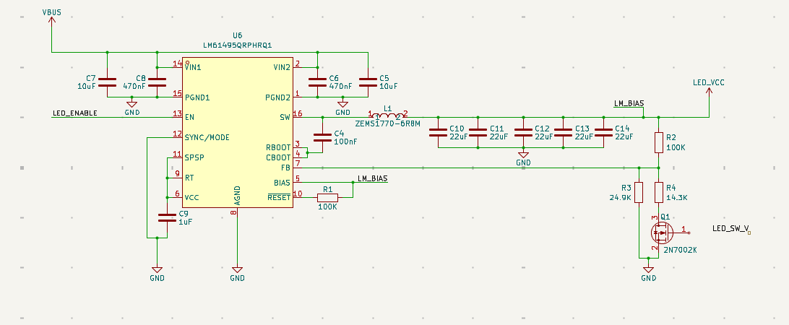
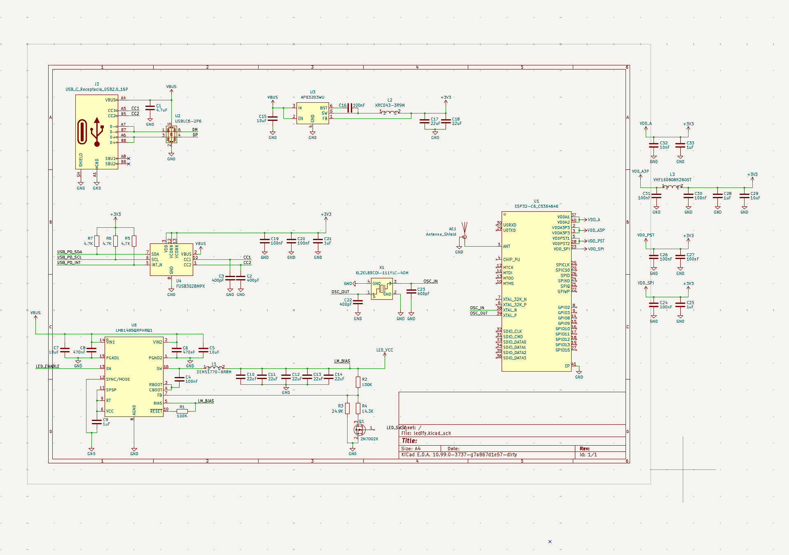
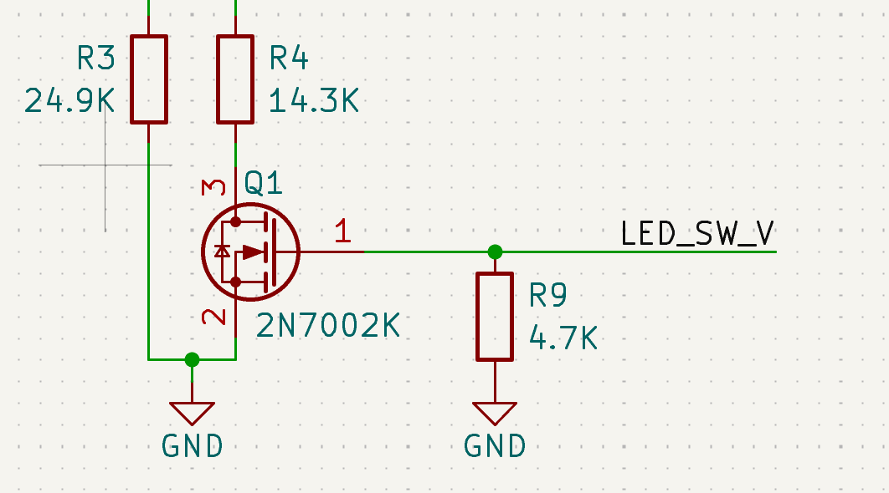
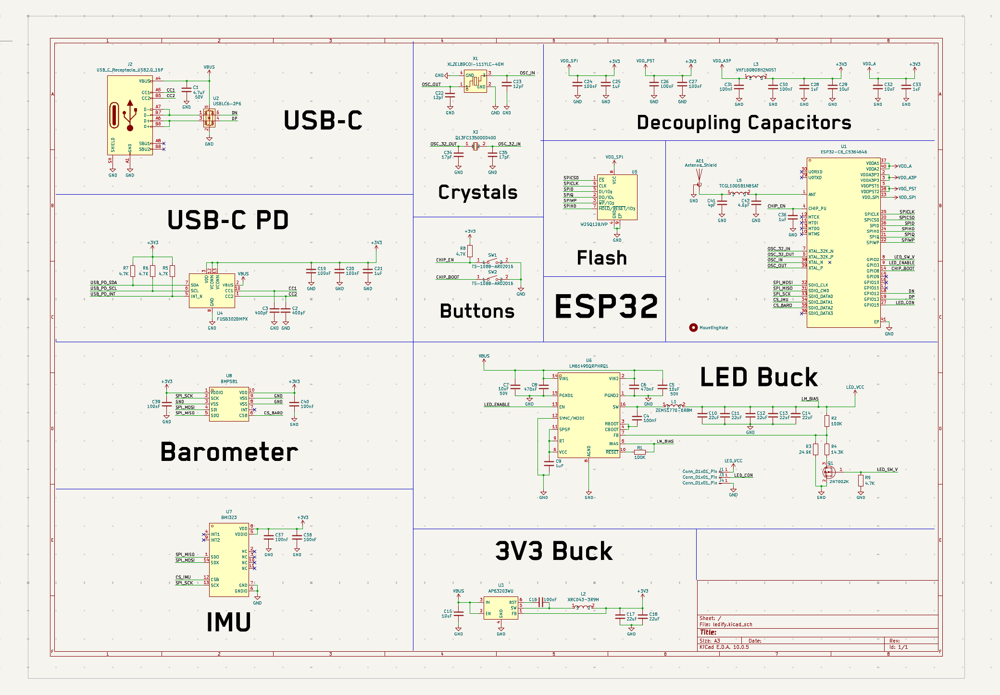
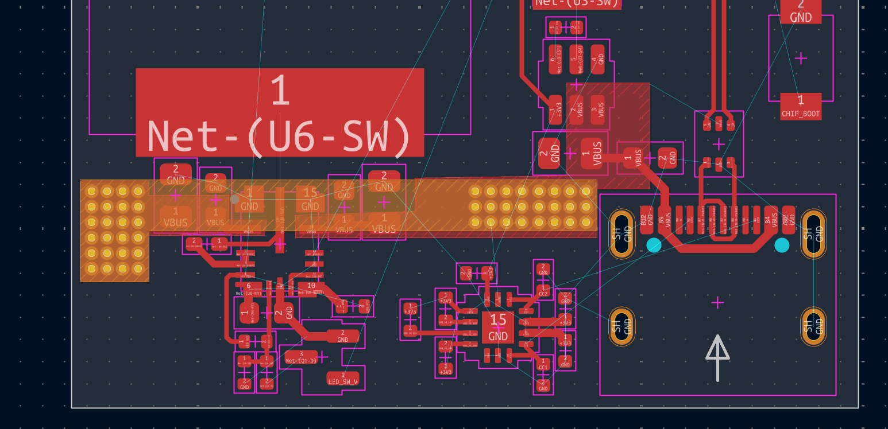
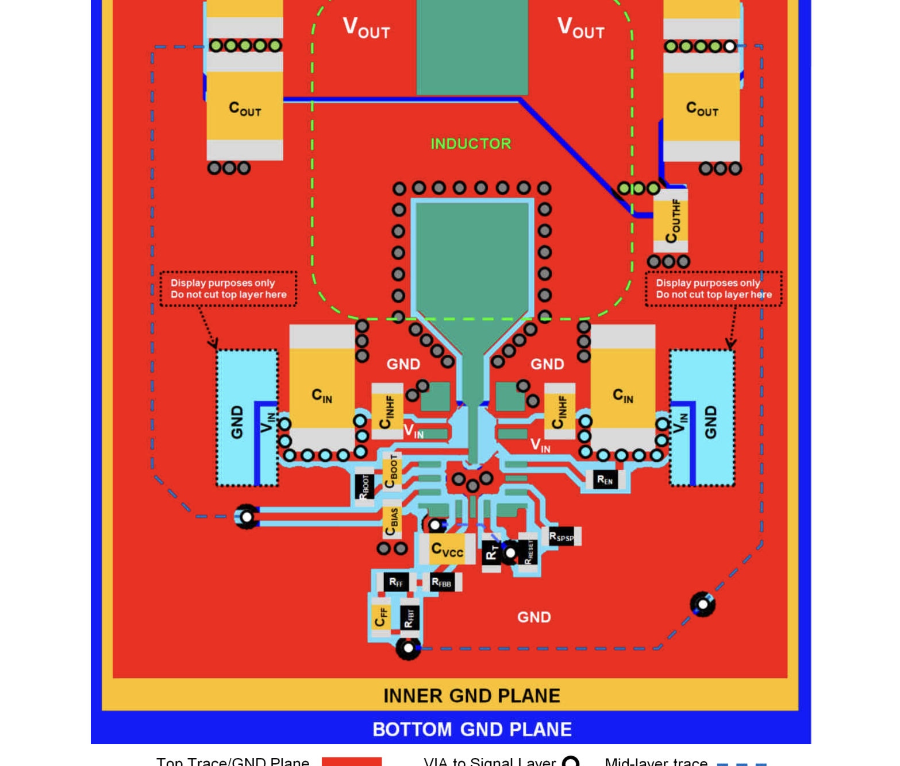
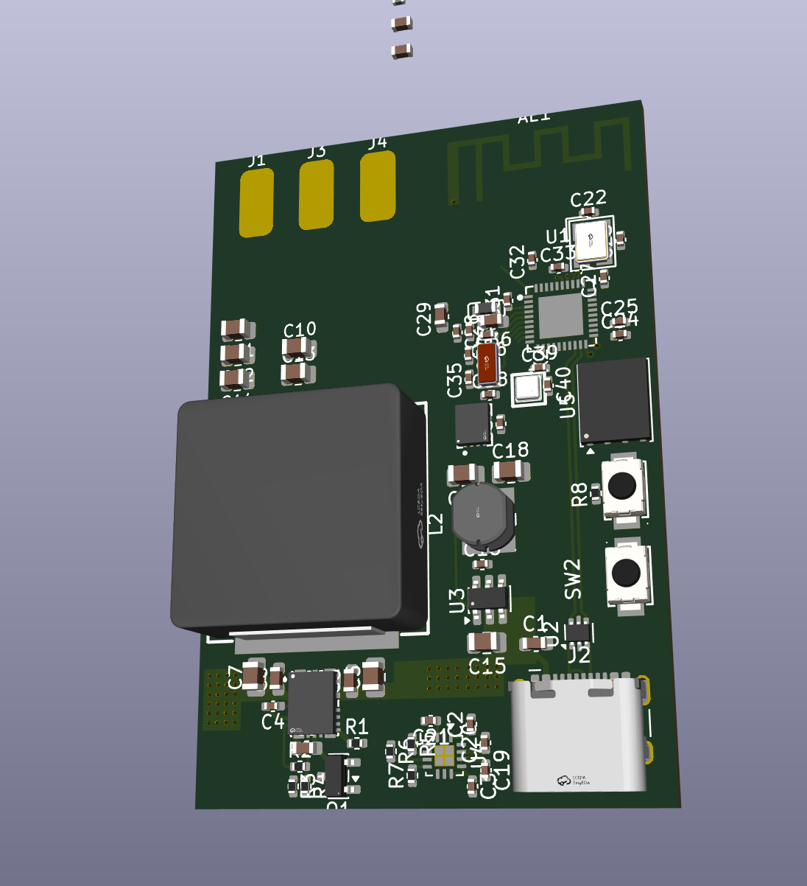
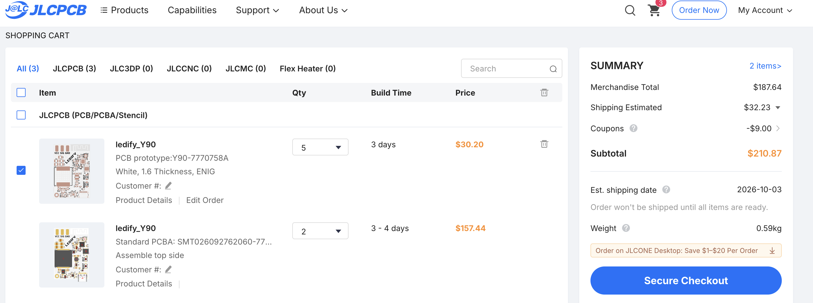

# Sept 8, 2026 - 8 hours

So I'm doing a thing where I'm trying to make a simple led controller that works with USB-C PD and yea. I want this to be able to power either 12V or 5V LEDs depending on a switch in software and ya. I got this so far as I'm using the FUSB302BMPX for USB-C PD negotiation and yea. I still have to choose my buck converters.

Finished big buck and also small buck and learned about n channel and p channel mosfets.

# Sept 12, 2026 - 10 hours

got basically everything done except the esp32 itself and yea

so I have the usb c going into the FUSB302 for the PD stuff over i2c and then a USBLC6 for esd on the data lines and ya. then theres the small buck (AP63203) that makes the 3V3 for the esp and the big buck with the HUGE inductor for the leds and yea I have the mosfet thing on the feedback so I can switch 5V or 12V from software

also added the crystal and all the decoupling caps for the esp, theres like a million power pins on the c6 (VDDA, VDDA3P3, VDDPST, VDD_SPI) so I put a ferrite on the analog one and caps on all of them like the datasheet says and ya

now I just have to figure out the esp pinout because I have no idea what goes where lol

# Sept 13, 2026 - 8 hours

ookay so I've been working on this on and off whenever I had time and I finally got around to finishing the schematic

the thing was I didn't know the esp32 pinout at all so I went through the datasheet and looked at some example schematics that other people made to get an idea of what goes where

and thats when I found out that on the esp32 literally ANY gpio can be spi or i2c because of the gpio matrix (with some regulations lol) so like you cant use 24-30 because thats the flash on the 40 pin version and 12/13 are usb and 8/9/15 are strapping pins so nothing can pull them at boot. also there are no input only pins on the c6 unlike the og esp32 so that made it easier and yea

# Sept 19, 2026 - 8 hours

after that I had to go back and look at the datasheet for the big buck again because I wanted to make sure the 5V/12V thing actually worked. basically theres a voltage divider on the feedback pin and the 2N7002K puts another resistor in parallel with the bottom one so off = 5V and on = 12V

but then I realized that when the esp is booting the gpio floats so the mosfet could randomly turn on and send 12V to a 5V strip and kill it so I decided to put a pull down resistor on the gate so it defaults to 5V and yea

also had to double check all the caps because VBUS can go up to 20V with PD so the input caps need to be rated for way more than what I had

# Sept 20, 2026 - 8 hours

schematic done so now its time for the pcb!!!

I had some trouble laying it out at first because the led inductor is HUGE (17.5mm) and I didn't know where to put it next to the esp and the flash. turns out its fine to have it next to the flash as long as the switch node is pointing away and the ground plane is solid so I just rotated it

the bigger problem was the antenna, I originally had it in the top left with the led pads and the crystal right next to it which is a big no no because anything metal near the antenna detunes it. so I moved the antenna to the top right corner against both edges and the led pads to the other side and the crystal below the esp and yea

after a bit of moving stuff around I finally decided on a general layout and grouped everything (usb, small buck, big buck, esp + flash) and started routing

# Sept 26, 2026 - 8 hours

I routed the usb stuff first since that was the easiest and then went through the rest

then it was time for the antenna and heres where I had to learn a bit more about rf theory. I'm using a meander pcb antenna and apparently the ground plane is literally part of the antenna so it has to be at a specific distance from it. I originally had a massive keepout below it with the feed trace running through empty board which is bad because the trace has no ground reference so its basically another antenna lol

so I pulled the ground pour up so its right under the antenna pads and made the feed trace super short with vias on both sides and yea

I also had to make a matching circuit for the first time!! the antenna is like 35 + 10j ohms and the esp wants 50 + 0j so I had to calculate the pi network to get it there and it was the first time actually doing the smith chart stuff for real instead of just copying values

for the big buck I followed the layout in the datasheet and kept the input caps right at the pins since thats the hot loop. I was also wondering if I should mirror the LED_VCC pour on the bottom with vias for the current but it would cut a hole in the ground plane so its just on top and I'll get 2oz copper instead and ya

and after around 7 hours of routing today its DONE

# Sept 27, 2026 - 2.5 hours

I then did a think with LCSC and JLCPCB and got the final quote on it, I had to bom match because of the 22uF caps adn they had to be rated for 25V because yea usb goes up to 20v

In total it went up to 210 usd ish with shipping and assembly so I think that this is good.
