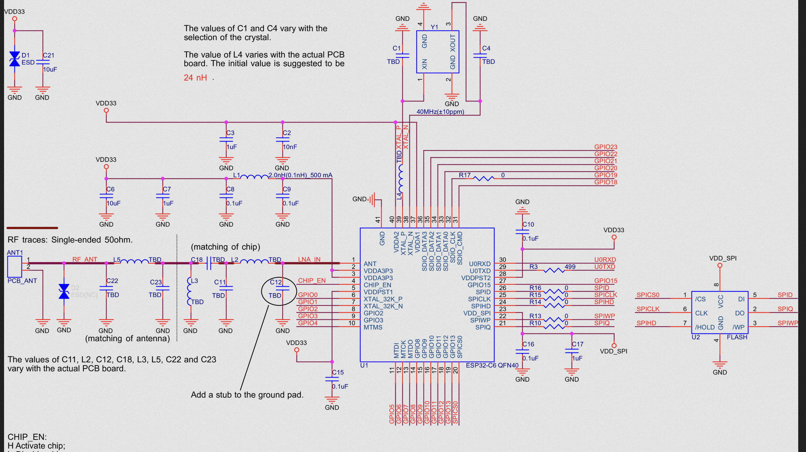
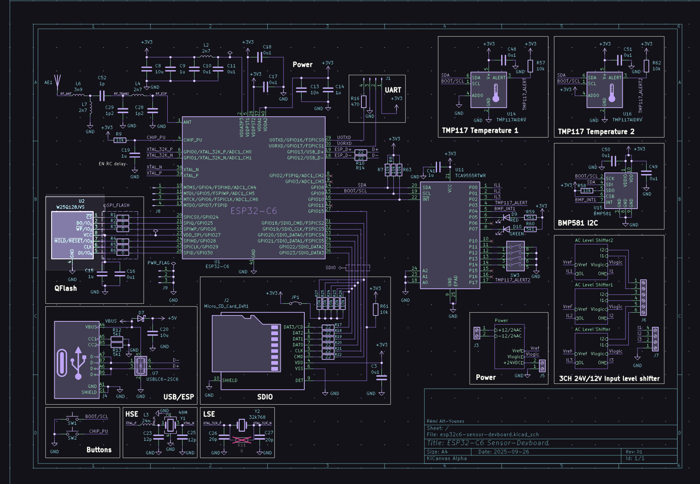
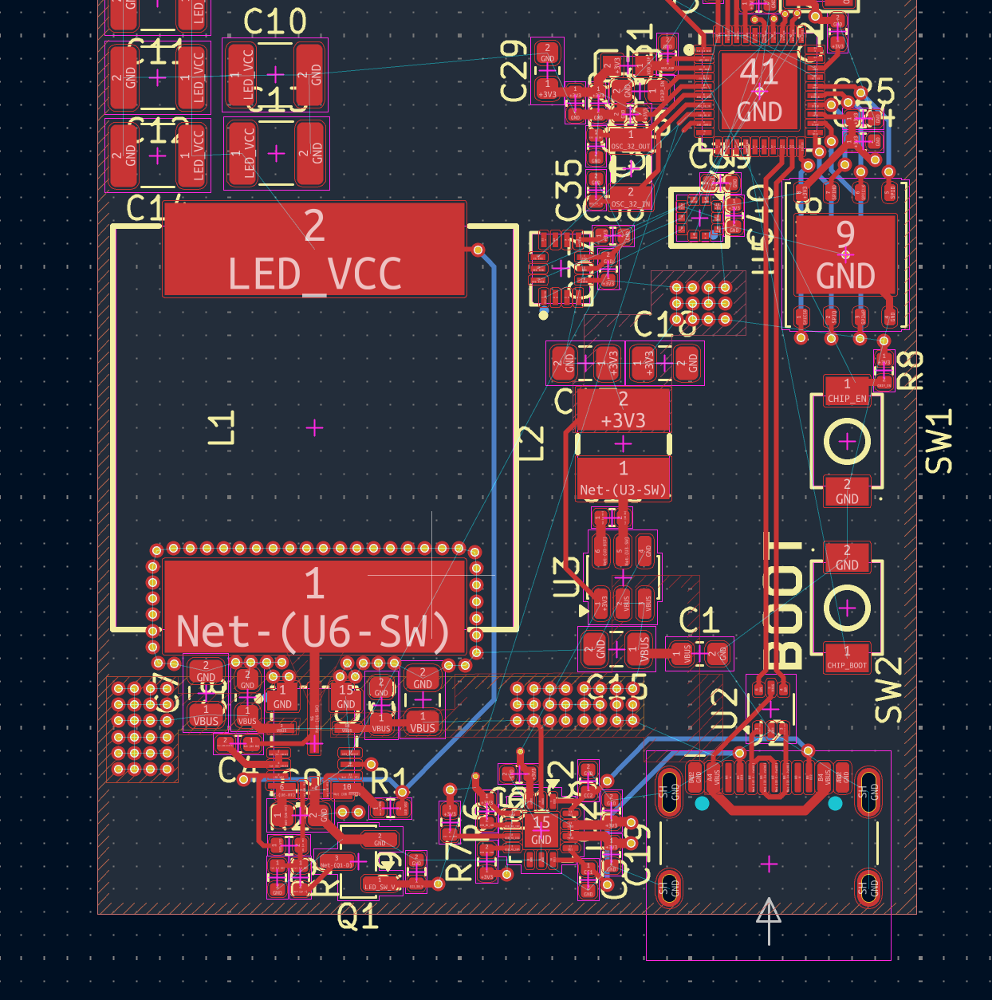
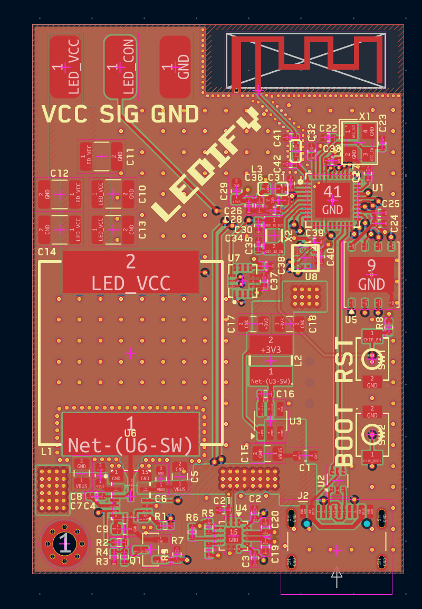
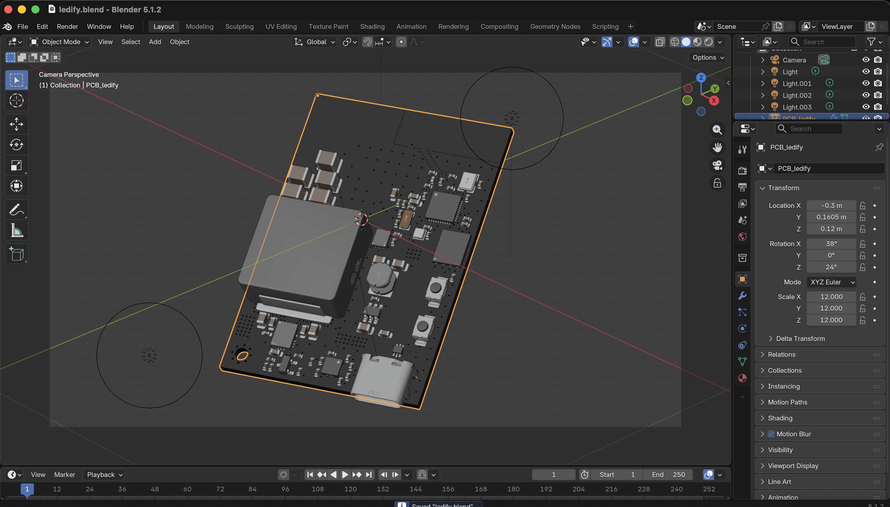
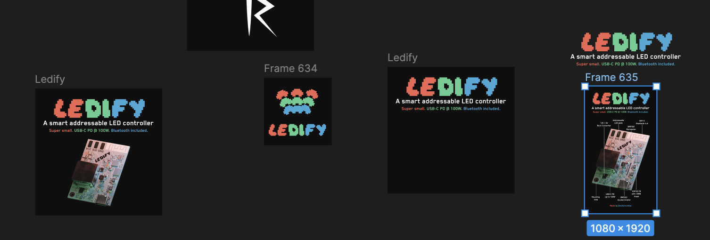
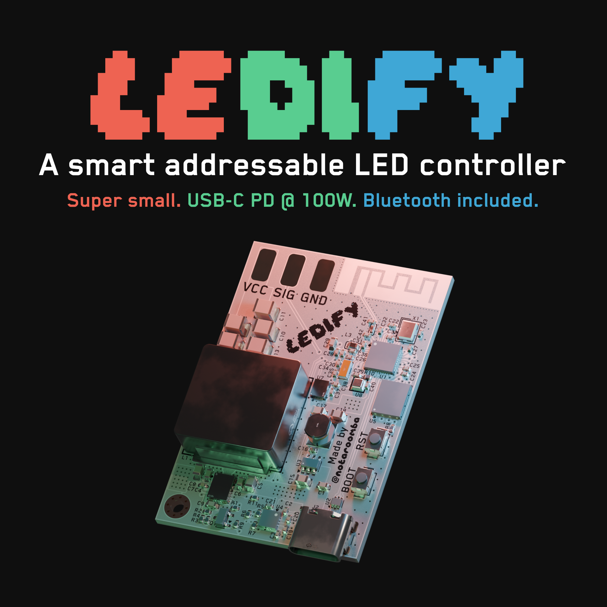
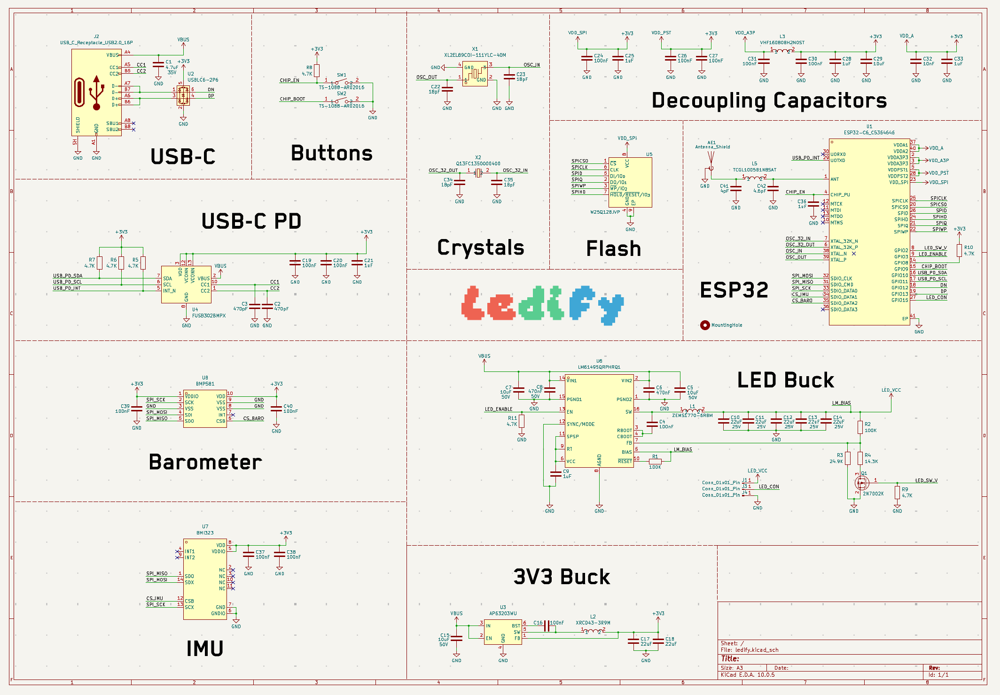
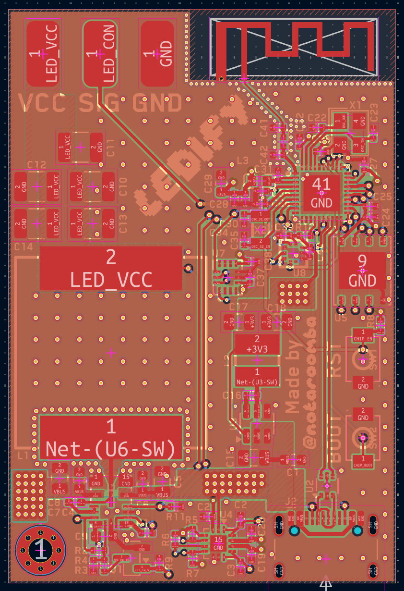
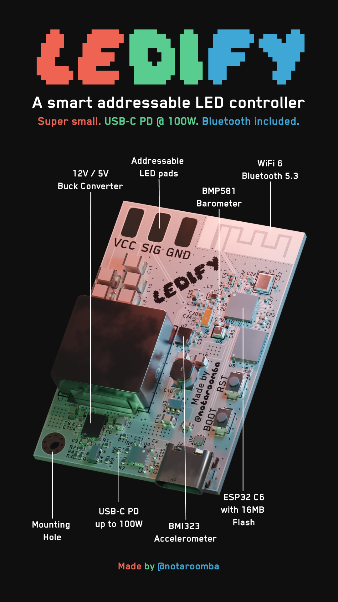

# Sep 5, 2026

So I'm doing a thing where I'm trying to make a simple led controller that works with USB-C PD and yea. I want this to be able to power either 12V or 5V LEDs depending on a switch in software and ya. I got this so far as I'm using the FUSB302BMPX for USB-C PD negotiation and yea. I still have to choose my buck converters.

Finished big buck and also small buck and learned about n channel and p channel mosfets.

**Total time spent: 6 hours**

# Sep 12, 2026

got basically everything done except the esp32 itself

so I have the usb c going into the FUSB302 for the PD stuff over i2c and then a USBLC6 for esd on the data lines. then theres the small buck (AP63203) that makes the 3V3 for the esp and the big buck with the HUGE inductor for the leds and yea I have the mosfet thing on the feedback so I can switch 5V or 12V from software

also added the crystal and all the decoupling caps for the esp, theres like a million power pins on the c6 (VDDA, VDDA3P3, VDDPST, VDD_SPI) so I put a ferrite on the analog one and caps on all of them like the datasheet says

now I just have to figure out the esp pinout because I have no idea what goes where lol

**Total time spent: 7 hours**

# Sep 13, 2026

ookay so I've been working on this on and off whenever I had time and I finally got around to finishing the schematic

the thing was I didn't know the esp32 pinout at all so I went through the datasheet and looked at some example schematics that other people made to get an idea of what goes where

and thats when I found out that on the esp32 literally ANY gpio can be spi or i2c because of the gpio matrix (with some regulations lol) so like you cant use 24-30 because thats the flash on the 40 pin version and 12/13 are usb and 8/9/15 are strapping pins so nothing can pull them at boot. also there are no input only pins on the c6 unlike the og esp32 so that made it easier and yea

**Total time spent: 6 hours**

# Sep 19, 2026

after that I had to go back and look at the datasheet for the big buck again because I wanted to make sure the 5V/12V thing actually worked. basically theres a voltage divider on the feedback pin and the 2N7002K puts another resistor in parallel with the bottom one so off = 5V and on = 12V

but then I realized that when the esp is booting the gpio floats so the mosfet could randomly turn on and send 12V to a 5V strip and kill it so I decided to put a pull down resistor on the gate so it defaults to 5V

also had to double check all the caps because VBUS can go up to 20V with PD so the input caps need to be rated for way more than what I had

**Total time spent: 6 hours**

# Sep 20, 2026

schematic done so now its time for the pcb!!!

I had some trouble laying it out at first because the led inductor is HUGE (17.5mm) and I didn't know where to put it next to the esp and the flash. turns out its fine to have it next to the flash as long as the switch node is pointing away and the ground plane is solid so I just rotated it

the bigger problem was the antenna, I originally had it in the top left with the led pads and the crystal right next to it. so I moved the antenna to the top right corner against both edges and the led pads to the other side and the crystal below the esp

after a bit of moving stuff around I finally decided on a general layout and grouped everything (usb, small buck, big buck, esp + flash) and started routing

**Total time spent: 5 hours**

# Sep 26, 2026

I routed the usb stuff first since that was the easiest and then went through the rest

then it was time for the antenna and heres where I had to learn a bit more about rf theory. I'm using a meander pcb antenna and apparently the ground plane is literally part of the antenna so it has to be at a specific distance from it. I originally had a massive keepout below it with the feed trace running through empty board which is bad because the trace has no ground reference so its basically another antenna lol

so I pulled the ground pour up so its right under the antenna pads and made the feed trace super short with vias on both sides and yea

I also had to make a matching circuit for the first time!! the esp is like 35 + 10j ohms and the antenna wants 50 + 0j so I had to calculate the pi network to get it there and it was the first time actually doing the smith chart stuff for real instead of just copying values

for the big buck I followed the layout in the datasheet and kept the input caps right at the pins since thats the hot loop. I was also wondering if I should mirror the LED_VCC pour on the bottom with vias for the current but it would cut a hole in the ground plane so I left the ground plane alone

and after around 7 hours of routing today its DONE

**Total time spent: 8 hours**

# Sep 27, 2026

I then did a think with LCSC and JLCPCB and got the final quote on it, I had to bom match because of the 22uF caps adn they had to be rated for 25V because yea usb goes up to 20v

In total it went up to 210 usd ish with shipping and assembly so I think that this is good.

**Total time spent: 2.5 hours**

# Sep 28, 2026

ookay so with the pcb done I started on the blender render yesterday and yea

I exported the board as a pcb3d and imported it into blender and then set up the camera and a bunch of lights around it

the first renders looked kinda drab so I went through a few versions moving the lights around and giving them colors (red green and blue like an rgb led lol) until it looked good

then today I went on figma and made the logo and the banner and also a flyer that shows everything on the board. I also found a cool pixel font for the name and put it on the silkscreen too

and this is how it ended up!!

but then I went back and double checked the schematic and found a few errors lol

the biggest one was that the FUSB302 i2c lines weren't even connected to the esp (they just went to the pull up resistors) so it wouldn't have been able to get anything above 5V which is kinda the whole point of the board. I also had the boot button on GPIO8 instead of GPIO9 so I moved it and put a pull up on GPIO8

then theres the usb esd chip, I had its VBUS pin on VBUS but it can only handle like 6V so with PD at 20V it would have died, so now its on 3V3. I also added a pull down on the led enable so the buck doesn't turn on by itself when the esp is booting

after that I went through all of the LCSC part numbers and some of them didn't match, like the 10uF caps on VBUS were actually 25V instead of 50V and the crystal caps were wrong (the crystals want a 12pF load so the caps have to be 18pF) so I fixed those too

and now the drc has no more errors and the bom matches the schematic so its finally ready to order

**Total time spent: 5 hours**

# Sep 29, 2026

so the board was "done" but I kept thinking of stuff to add lol

first I wanted an ambient light sensor so the leds can dim themselves when the room is dark. I went with the OPT4001 and it's i2c so I just put it on the same bus as the FUSB302 and didn't have to use any more pins. the only space left was next to the 3V3 buck so I put it on the output side away from the inductor. when I added it I accidentally ran some tracks straight through a group of 3V3 vias and shorted CHIP_EN and MISO to 3V3 so I had to fix that

then I looked at the return paths around the esp32 because I thought it was interesting and it turns out I had signal tracks on the inner layers cutting slots in the ground plane right under the chip, and there was only ONE ground via under the esp. so I moved CS_BARO and LED_CON off the planes, changed a few pins around (led data is on GPIO5 now and CS_BARO on GPIO7) and added more ground vias under it

after that I wanted a microphone so the leds can react to sound. I started with an analog one (ZTS6117) but the output is only a few millivolts so the esp adc can't really read it without an op amp and like 10 more parts. so I looked at the MAX9814 and then decided on an i2s mic instead because its one part and the signal is digital so the bucks can't mess with it

I also tied SYNC/MODE on the big buck to 3V3 so it always switches at the same frequency and doesn't make the caps hum next to the mic

**Total time spent: 4 hours**

# Sep 30, 2026

the i2s mic I picked (MSM261S4030H0R) was out of stock on LCSC so I spent a while looking for another one. apparently top port i2s mics basically don't exist, almost all of them have the hole on the bottom, so I went with the ICS-43434 which is a bit smaller and listens through a hole in the pcb

the footprint had the sound hole as a plated hole with no copper around it which jlc can't make so I changed it to a 0.5mm non plated hole

I also double checked the antenna again. the feed trace is the 50 ohm width for the JLC04161H-3313 stackup and nothing is inside the keepout on any layer so I just have to remember to pick that stackup when I order

then I fixed a 0.1mm track I missed, exported the production files again and redid the renders with the new parts

with the extra sensors the pcba is around 300 usd now for 2 assembled boards, I looked at how much it would be to assemble them myself and its way cheaper per board but the esp32 is 0.4mm pitch and there are 3 LGA sensors so I'm going with pcba for this one

**Total time spent: 2.5 hours**
