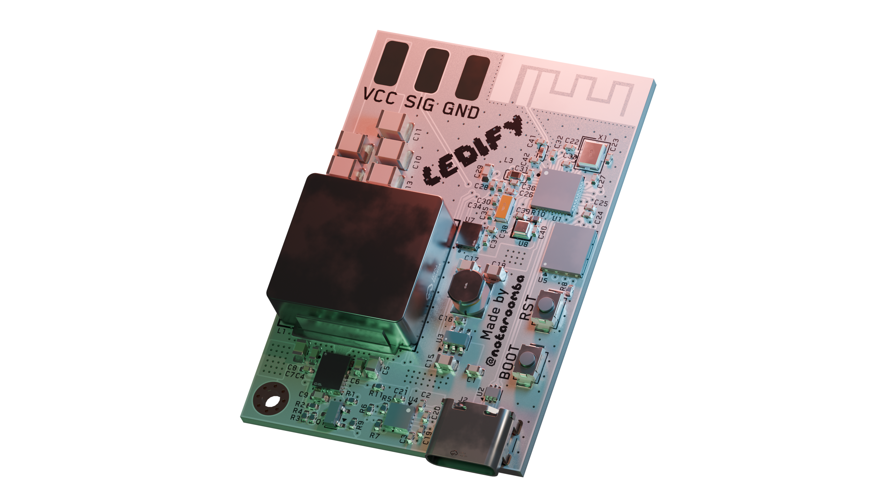

<h1 align="center">
  <br>
  <a href="https://notaroomba.dev"></a>
</h1>

<h4 align="center">
A super small addressable LED controller with USB-C PD up to 100W, a switchable 5V/12V output and Bluetooth!
</h4>

<div align="center">


</div>

<p align="center">
  <a href="#key-features">Key Features</a> •
  <a href="#pcb">PCB</a> •
  <a href="#firmware">Firmware</a> •
  <a href="#credits">Credits</a> •
  <a href="#license">License</a>
</p>



## Key Features

- **ESP32-C6** microcontroller with Wi-Fi 6 and Bluetooth LE
- **16MB flash** (W25Q128JVP)
- **USB-C PD** up to 100W with the FUSB302B
- **Switchable 5V/12V LED output** from a 10A buck converter (LM61495), selected in software
- **Addressable LED pads** (VCC / SIG / GND) for WS2812B, WS2811 and WS2815 strips
- **IMU and Barometer** - BMI323 (6-axis) and BMP581 pressure sensor
- **Ambient light sensor** (OPT4001) for automatic brightness
- **I2S microphone** (ICS-43434) for sound-reactive effects
- **PCB trace antenna** with an impedance matching network
- **3.3V buck converter** (AP63203) for the logic side
- **ESD protection** on the USB data lines
- **Reset and boot buttons** and a mounting hole
- **4-layer PCB** design with optimized RF layout and routing


## PCB

Designed in KiCad with attention to RF design and high current power delivery. The board is 4 layers with a solid ground plane under the ESP32, the flash and the antenna feed, and the LED buck follows the layout in the LM61495 datasheet.

### Schematic


### Layout


### Pinout

| GPIO | Net        | Function                                  |
| ---- | ---------- | ----------------------------------------- |
| 2    | LED_SW_V   | LED voltage select (low = 5V, high = 12V) |
| 3    | LED_ENABLE | LED buck enable                           |
| 5    | LED_CON    | LED data (SIG pad)                        |
| 6    | MIC_OUT    | Microphone I2S data                       |
| 22   | MIC_CS     | Microphone I2S word select                |
| 23   | MIC_SCK    | Microphone I2S bit clock                  |
| 10   | I2C_SDA    | I2C data (FUSB302B, OPT4001)              |
| 11   | I2C_SCL    | I2C clock (FUSB302B, OPT4001)             |
| 16   | USB_PD_INT | FUSB302B interrupt                        |
| 18   | SPI_MISO   | Sensor SPI                                |
| 19   | SPI_MOSI   | Sensor SPI                                |
| 20   | SPI_SCK    | Sensor SPI                                |
| 21   | CS_IMU     | BMI323 chip select                        |
| 7    | CS_BARO    | BMP581 chip select                        |
| 12   | DN         | USB D-                                    |
| 13   | DP         | USB D+                                    |
| 9    | CHIP_BOOT  | Boot button                               |
| 8    | -          | Strapping pin, pulled up to 3V3           |

### JLCPCB Quote


## Firmware

The boilerplate in [`firmware/main.py`](firmware/main.py) is written in MicroPython. It advertises over Bluetooth as `Ledify` with the Nordic UART service, so any BLE UART app (nRF Connect, Bluefruit Connect) can control the strip.

| Command     | Action                                      |
| ----------- | ------------------------------------------- |
| `on`        | Turns on the LED buck                       |
| `off`       | Clears the strip and turns off the LED buck |
| `rgb R G B` | Fills the strip with a color (0-255 each)   |
| `volt 5`    | Selects 5V, turns the output off first      |
| `volt 12`   | Selects 12V, turns the output off first     |

The output always boots at 5V and off. Set `NUM_LEDS` and `MAX_LEVEL` at the top of the file for your strip.

### Flashing

1. Flash the [MicroPython ESP32-C6 firmware](https://micropython.org/download/ESP32_GENERIC_C6/) over USB with `esptool`
2. Copy the boilerplate to the board:

```bash
mpremote cp firmware/main.py :main.py
```

3. Press RST and connect to `Ledify` over Bluetooth

To run the parser self-check on your computer:

```bash
python3 firmware/main.py
```

## Credits

This project uses:

- [KiCad](https://www.kicad.org/)
- [Blender](https://www.blender.org/) for 3D renders
- [MicroPython](https://micropython.org/)

## You may also like...

- [Cyberboard](https://github.com/NotARoomba/cyberboard) – A Raspberry Pi Pico-sized STM32 development board
- [CyberCard](https://github.com/NotARoomba/CyberCard) – A Cyberpunk themed NFC hacker card
- [Ember](https://github.com/NotARoomba/ember) – USB-C PD Powered Hotplate
- [Trace](https://github.com/NotARoomba/trace) – An ruler for engineers
- [Athena](https://github.com/NotARoomba/athena) – A flight controlelr with a triple MCU architecture

## License

MIT

---

> [notaroomba.dev](https://notaroomba.dev) &nbsp;&middot;&nbsp;
> GitHub [@NotARoomba](https://github.com/NotARoomba) &nbsp;&middot;&nbsp;
